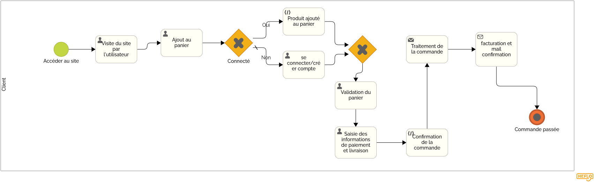

= Fiche de conseils juridiques et de sécurité pour le site e-commerce Lutin&Co

== Table des matières

- <<introduction,Introduction>>
- <<mentions_legales,Mentions légales obligatoires du site web>>
- <<processus_vente,Description détaillée du processus de vente en ligne (BPMN)>>
- <<protection_donnees,Mesures de protection des données et modalités de mise en œuvre>>
- <<securite_donnees,Mesures de sécurité des données et modalités de mise en œuvre>>
- <<user_stories,User Stories à ajouter au dernier sprint>>
- <<conclusion,Conclusion>>

[[introduction]]
== Introduction

Le site e-commerce Lutin&Co, afin de garantir une expérience de vente en ligne fluide et conforme aux exigences légales et sécuritaires, doit adopter des pratiques respectueuses des obligations juridiques et des normes de protection des données. Ce document présente les conseils et les mesures indispensables à mettre en place pour assurer la conformité avec la législation française et européenne en matière de données personnelles, ainsi que des recommandations pour sécuriser le processus de vente et protéger les informations des utilisateurs.

[[mentions_legales]]
== Mentions légales obligatoires du site web

Les mentions légales d’un site e-commerce doivent respecter les obligations légales imposées par la réglementation en vigueur, notamment en matière de protection des données personnelles. Voici la liste des mentions légales que doit comporter le site web de Lutin&Co :

- **Identité de l’éditeur** : nom ou raison sociale, adresse, numéro de téléphone, email.
- **Numéro d’immatriculation** : numéro SIREN, SIRET ou RCS.
- **Hébergeur du site** : nom, adresse, numéro de téléphone et email de l’hébergeur.
- **Directeur de la publication** : nom de la personne responsable de la publication du site.
- **Conditions générales de vente (CGV)** : précisant les conditions de vente, la politique de livraison, de retour et de remboursement.
- **Politique de confidentialité** : expliquant comment les données personnelles sont collectées, traitées et sécurisées.
- **Utilisation des cookies** : mention sur la collecte des cookies, avec possibilité pour l’utilisateur d’accepter ou de refuser.
- **Protection des données personnelles (RGPD)** : description des droits des utilisateurs (accès, rectification, suppression, opposition, etc.) et du responsable du traitement.

Mentions manquantes sur le site de Lutin&Co :

- Politique de confidentialité non clairement détaillée.
- Consentement pour l’utilisation des cookies pas explicite.

[[processus_vente]]
== Description détaillée du processus de vente en ligne (BPMN)

Le diagramme de collaboration BPMN pour le processus de vente en ligne doit comprendre les étapes suivantes :

1. **Visite du site par l’utilisateur** : le client explore les produits.
2. **Ajout au panier** : le client ajoute des produits au panier.
3. **Identification/Création de compte** : l’utilisateur doit s’identifier ou créer un compte s’il est nouveau.
4. **Validation du panier** : le client vérifie les articles, les quantités, le total, etc.
5. **Saisie des informations de paiement et livraison** : le client entre ses informations de livraison et de paiement.
6. **Confirmation de la commande** : le client confirme la commande.
7. **Traitement de la commande** : le site procède au traitement de la commande.
8. **Expédition et livraison** : les produits sont expédiés et livrés au client.
9. **Facturation et suivi de la commande** : une facture est générée, le client peut suivre son colis.

[[protection_donnees]]
== Mesures de protection des données et modalités de mise en œuvre

Voici une liste des mesures à mettre en place pour assurer la protection des données personnelles, ainsi que leur mode de mise en œuvre, certaines données ont déjà été mises en œuvre :

[cols="3,5,2"]
|===
| **Mesure** | **Modalités** | **Priorité**

| Consentement explicite pour la collecte des données | Ajouter une case à cocher lors de la création du compte ou lors de la première connexion pour recueillir le consentement explicite des utilisateurs | Haute
| Chiffrer les données sensibles | Chiffrer ou pseudonymiser les données sensibles (par exemple, numéros de carte bancaire) lors du traitement | Haute
| Limitation de la durée de conservation des données | Mettre en place un système de suppression automatique des données personnelles après un certain délai d'inactivité | Moyenne
| Droit d'accès, de rectification, et de suppression des données | Implémenter une interface utilisateur permettant de consulter, modifier ou supprimer les données personnelles | Moyenne
| Sécurisation des données lors de leur transfert | Utiliser un protocole de sécurité (TLS) pour crypter les données sensibles lors des transactions | Haute
|===

[[securite_donnees]]
== Mesures de sécurité des données et modalités de mise en œuvre

Voici les mesures pour sécuriser les données sur le site de Lutin&Co :

[cols="3,5,2"]
|===
| **Mesure** | **Modalités** | **Priorité**

| Utilisation du HTTPS pour le site | Configurer le certificat SSL/TLS sur le serveur pour garantir une connexion sécurisée entre le client et le serveur | Haute
| Authentification forte | Implémenter une double authentification pour les utilisateurs lors de la connexion à leur compte | Haute
| Protection contre les attaques XSS/CSRF | Mettre en place des contrôles pour prévenir les attaques de type Cross-Site Scripting et Cross-Site Request Forgery | Moyenne
| Sauvegardes régulières des données | Planifier des sauvegardes régulières des données utilisateurs, des commandes et des transactions | Moyenne
| Système de modération | Possibilité de supprimer des comptes et des avis qui ne respectent pas les règles de respect | Haute
|===

[[user_stories]]
== User Stories à ajouter au dernier sprint

Voici quelques User Stories (US) que l'on pourrait ajouter au dernier sprint ou plus tard sur le site pour assurer la mise en conformité du site avec les exigences légales et sécuritaires :

[cols="3,5,2"]
|===
| **User Story** | **Description** | **Priorité**

| US001 | En tant qu’utilisateur, je souhaite avoir une politique de confidentialité claire et accessible pour savoir comment mes données sont traitées. | Haute
| US002 | En tant qu’utilisateur, je veux pouvoir donner mon consentement explicite à la collecte de mes données personnelles lors de la création de mon compte. | Haute
| US003 | En tant qu’utilisateur, je veux pouvoir modifier ou supprimer mes données personnelles à tout moment via mon compte. | Moyenne
| US004 | En tant qu’utilisateur, je souhaite recevoir un email de confirmation de ma commande avec les informations nécessaires (produits, prix, délais de livraison). | Moyenne
| US005 | En tant que responsable sécurité, je souhaite implémenter une double authentification pour les connexions aux comptes utilisateurs. | Haute
|===

[[conclusion]]
== Conclusion

Lutin&Co doit veiller à respecter toutes les obligations légales liées à la protection des données personnelles et à la sécurité des informations utilisateurs, conformément au RGPD et aux autres régulations en vigueur. La mise en œuvre des recommandations juridiques et sécuritaires présentées dans ce document permettra de garantir non seulement la conformité du site, mais également de renforcer la confiance des utilisateurs en assurant un environnement sécurisé pour leurs achats en ligne. Le respect de ces bonnes pratiques est essentiel pour assurer la pérennité du site et la satisfaction de ses clients.
