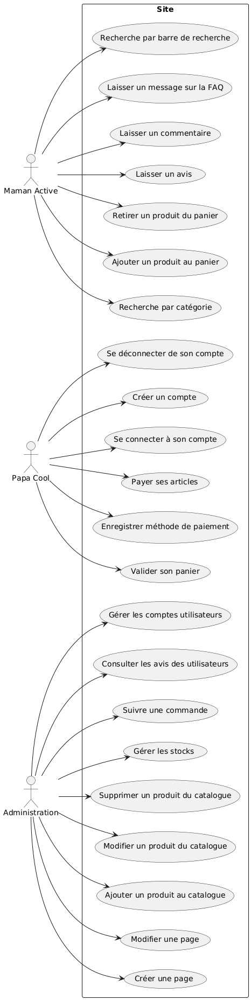
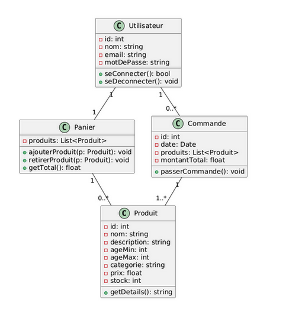
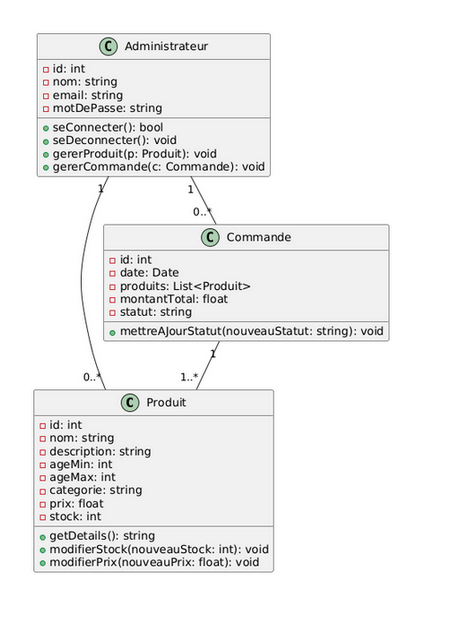
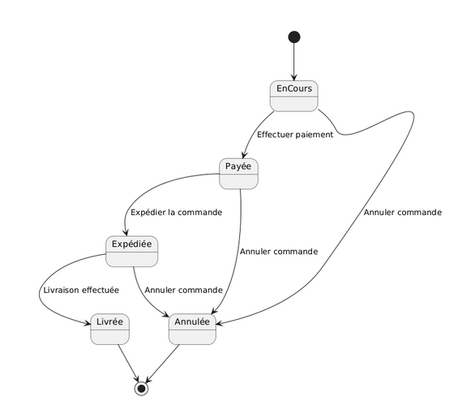
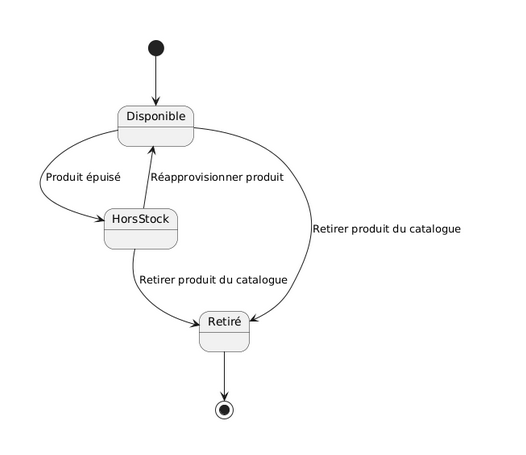
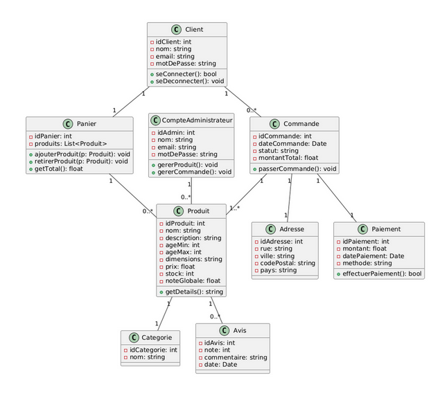

= Document De Conception

== SAE DEV APP S3

Université de Toulouse +
IUT de Blagnac +
Département Informatique  

[discrete]
=== Equipe : 1B5

[discrete]
=== Membres :
[cols="1,1,1,1,1", options="header"]
|===

|Simon CLAVEL | Bilon KWADJANI | Théo RABAN | Adrian GUERRERO | Adrien THEOPHILE

|===

[abstract]
Ce document de conception détaille l’architecture et les fonctionnalités d’un site e-commerce spécialisé dans la vente de jouets, servant de guide technique pour le développement de l’application. Il inclut une vue complète des cas d’utilisation, des classes métier, et des états de transition, essentiels pour structurer les interactions et assurer la cohérence technique du système.

== Table des matières

* <<introduction,Introduction>>
* <<I-UseCase,I-Use Case>>
* <<IIDiagrammeClassesMetier,II-Diagramme de Classes métier>>
  * <<DCMU,Diagramme de classe métier pour Utilisateur>>
  * <<DCMA,Diagramme de classe métier pour Administrateur>>
* <<IIIDiagrammeEtatTransition,III-Diagramme d’État transition>>
  * <<DETC,Diagramme d'État-Transition pour la Commande>>
  * <<DETP,Diagramme d'État-Transition pour le Produit>>
* <<IVDiagrammeClasseConception,IV-Diagramme de classe de Conception>>
* <<synthese,Synthèse>>

== [[introduction]] Introduction

Ce document de conception décrit l'architecture et les fonctionnalités d’un futur site e-commerce spécialisé dans la vente de jouets. Il vise à fournir une vue d’ensemble complète des cas d’utilisation, des classes métier, et des transitions d’état qui composeront l'application. À travers des diagrammes et des explications détaillées, ce document met en évidence la manière dont les différents types d’utilisateurs interagiront avec le système et explique les choix de conception pour répondre aux exigences fonctionnelles et techniques.

Le site est conçu pour offrir une expérience utilisateur fluide, permettant aux clients de parcourir facilement les produits, gérer leurs comptes, et passer des commandes en ligne. Les fonctionnalités d'administration, quant à elles, assurent une gestion efficace des stocks, des commandes, et des interactions clients. 

En tant que fondation technique pour le développement de l’application, ce document vise à guider les développeurs et les parties prenantes tout au long du processus de création. En offrant une base claire et structurée, il garantit une expérience utilisateur optimisée et une gestion efficace des opérations en ligne, permettant ainsi de répondre aux attentes des clients tout en assurant une administration fluide et sécurisée du site.

== [[I-UseCase]] I-Use Case

Ce diagramme de cas d’utilisation montre les différentes fonctionnalités accessibles aux utilisateurs selon leur rôle.

Les utilisateurs réguliers, comme Maman Active et Papa Cool, peuvent naviguer sur le site, interagir avec le contenu comme laisser des avis et des commentaires, gérer leurs comptes, et effectuer des achats en ligne.

Le rôle Administration dispose de droits supplémentaires pour gérer les utilisateurs, suivre les commandes, contrôler le stock, et administrer le catalogue et les pages du site.

En somme, le site est structuré pour offrir une expérience utilisateur complète aux clients tout en permettant une gestion efficace des opérations par les administrateurs.

== [[IIDiagrammeClassesMetier]] II-Diagramme de Classes métier

[[DCMU]] . 1.Diagramme de classe métier pour Utilisateur

. 2. <<DCMA,Diagramme de classe métier pour Administrateur>>

== [[IIIDiagrammeEtatTransition]] III-Diagramme d’État transition

Les deux diagrammes représentent le comportement dynamique d'un système ou d'un objet à travers ses différents états et les transitions entre eux. Nous avons réalisé un diagramme de transition pour la commande et un pour la gestion des stocks produits.

. 1.1. <<DETC,Diagramme d'État-Transition pour la Commande>>

. 1.2. <<DETP,Diagramme d'État-Transition pour le Produit>>

== [[IVDiagrammeClasseConception]] IV-Diagramme de classe de Conception

Dans le diagramme de classe métier, chaque classe représente un concept ou une entité du domaine métier de l’application. Voici le diagramme de classe métier de votre futur site.

Voici une synthèse des classes présentes dans le diagramme de classe métier :

* **Client** : Représente un utilisateur enregistré du site. Les attributs incluent idClient, nom, email, et motDePasse pour identifier chaque client et gérer la connexion/déconnexion.
* **CompteAdministrateur** : Représente un utilisateur ayant des privilèges d’administration, avec des attributs pour l’identification (idAdmin, nom, email, motDePasse). Il possède des méthodes pour gérer les produits et les commandes.
* **Produit** : Représente un jouet ou un article vendu sur le site, incluant des attributs comme idProduit, nom, description, prix, ageMin, ageMax, dimensions, stock, et noteGlobale pour décrire ses caractéristiques et sa disponibilité.
* **Catégorie** : Sert à organiser les produits en différentes catégories (ex. idCategorie, nom), facilitant la navigation pour les utilisateurs.
* **Avis** : Permet aux clients de donner des retours sur les produits avec une note, un commentaire, et une date, associés à un produit donné.
* **Panier** : Représente le panier d’achat d’un client, contenant une liste de produits sélectionnés. Les méthodes ajouterProduit et retirerProduit permettent la gestion des articles dans le panier.
* **Commande** : Représente une commande passée par un client, incluant idCommande, dateCommande, statut, et montantTotal. Elle est associée à des produits, une adresse de livraison et un paiement.
* **Adresse** : Contient les informations de livraison pour une commande (rue, ville, codePostal, pays), permettant une expédition correcte.
* **Paiement** : Représente les informations de paiement pour une commande, avec idPaiement, montant, datePaiement, et méthode. La méthode effectuerPaiement() permet de finaliser la transaction.

Ce modèle métier est conçu pour gérer l’ensemble des fonctionnalités d'un site de vente de jouets, en prenant en compte la gestion des utilisateurs, des produits, des commandes et des transactions.

== [[synthese]] Synthèse

Les diagrammes inclus dans ce document de conception constituent des outils essentiels pour structurer et orienter le développement du site e-commerce, en garantissant la cohérence entre les besoins fonctionnels, les choix d’architecture et les spécifications techniques. En offrant une vue d’ensemble des interactions, des états et des classes métier, ce document permet de prévenir les problèmes potentiels, d’assurer la conformité aux exigences et de faciliter les évolutions futures du système. Il servira de référence pour toutes les étapes de développement, permettant une mise en œuvre efficace et une expérience utilisateur optimisée pour les clients et les administrateurs du site.
