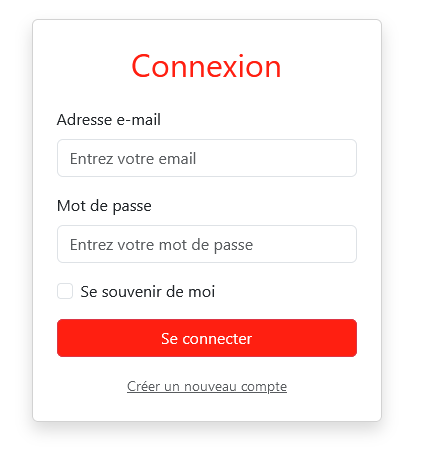
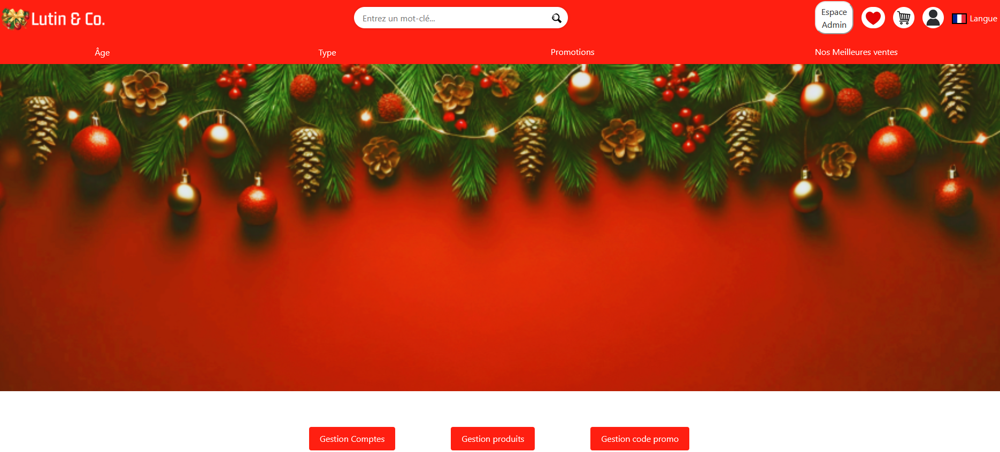
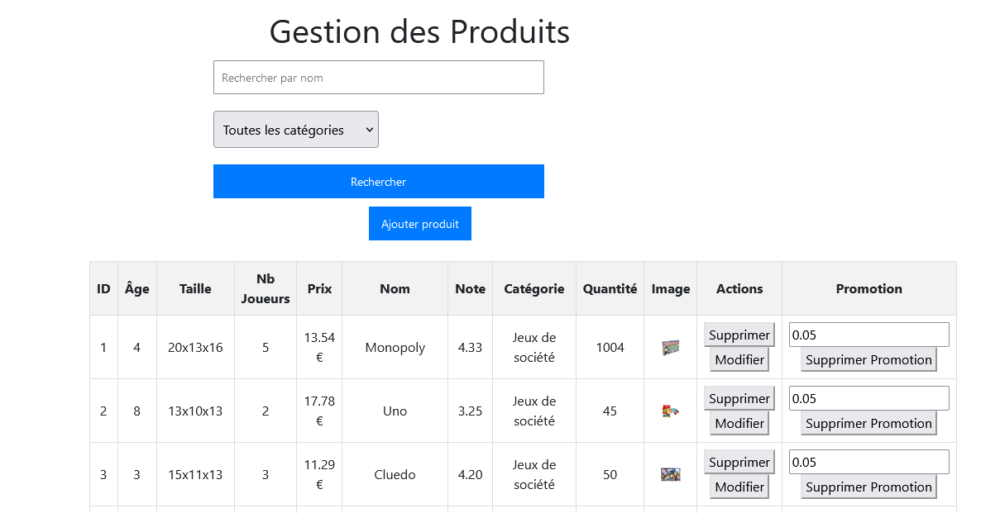
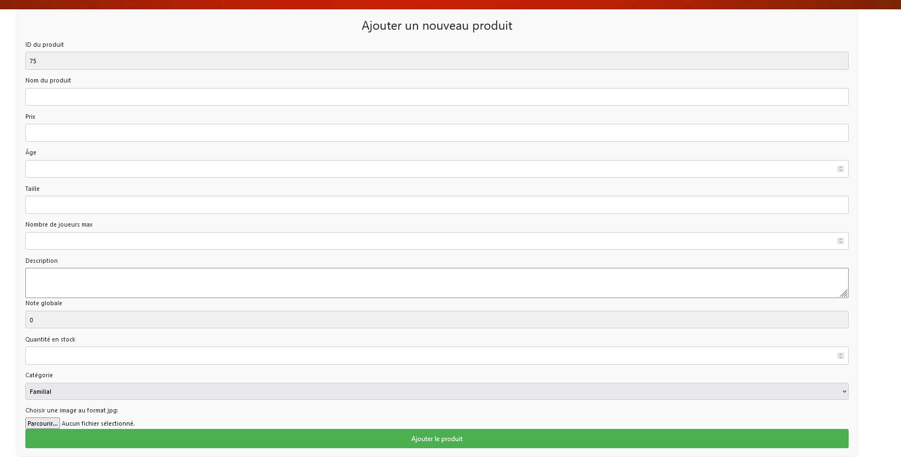
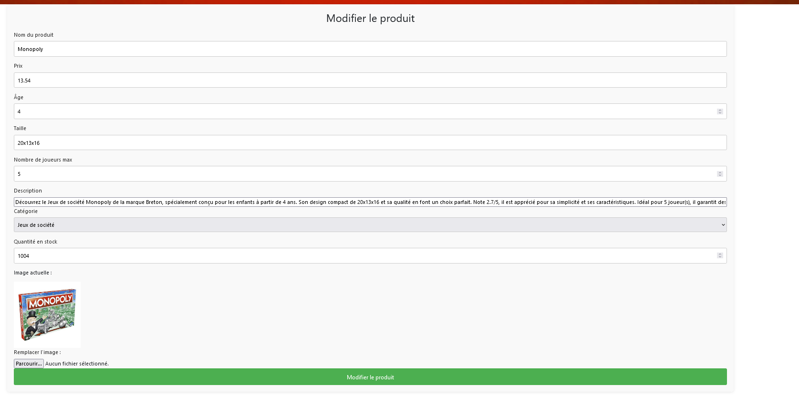

= Documentation Utilisateur - Lutin & Co
Bienvenue sur Lutin & Co, votre boutique en ligne de jouets pour des fêtes de Noël magiques ! Cette documentation vous guidera dans l’utilisation de notre site pour trouver, acheter, et offrir des jouets à vos proches en cette saison festive.

== Table des matières
1. Introduction
2. Gestion Produit
   * Ajouter produit
   * Modifier produit
   * Supprimer produit
3. Gestion Utilisateur
   * Promouvoir utilisateur
   * Supprimer compte
4. Gestion Codes promotions
   * Ajouter code promotion
   * Supprimer code promotion
   * Modifier code promotion
5. Favoris
   * Ajouter au favoris
   * Rechercher un produit
   * Découvrir les nouveautés et les promotions

== 1. Introduction
Lutin & Co est la destination idéale pour vos achats de Noël. Notre site propose une large gamme de jouets soigneusement sélectionnés pour tous les âges, des cadeaux magiques pour faire plaisir à vos enfants, vos proches, ou même pour vous offrir un peu de joie. Découvrez notre sélection et profitez de notre service de livraison rapide pour garantir un Noël sans souci.

== 2. Gestion Produit

Pour accéder à la page de gestion des produits pour l'administrateur  il faut d'abord accéder à la page d'accueil et cliquer sur l'icone d'identification en haut à droite.

Ensuite connectez vous avec un compte administrateur.

Cliquer désormais sur l'icone "Espace Admin" qui apparaît en haut à droite.

Vous arrivez sur la page de gestion administrateur

Cliquer sur gestion Produit.

=== Ajouter produit

Depuis la page de gestion produit vous pouvez rechercher un produit, en ajouter un, en modifier un et en supprimer un. Nous allons nous intéresser à l'ajout des produits pour cela cliquer sur ajouter produit.

Remplisser le formulaire et ajouter une image puis valider, une fois validé le produit est ajouté et est consultable.

=== Modifier produit

Pour modifier un produit repartez de la page gestion Produit et séléctionner modifier produit au bout de la ligne (présent au bout de la ligne de chaqe article).

Valider quand les modifications souhaités ont été effectuées.

=== Supprimer produit

== 3. Gestion Utilisateur

=== Promouvoir utilisateur

=== Supprimer compte

== 4. Gestion Codes promotions

=== Ajouter code promotion

=== Supprimer code promotion

=== Modifier code promotion

== 5. Favoris

=== Ajouter au favoris

=== Rechercher un produit

=== Découvrir les nouveautés et les promotions
